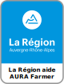
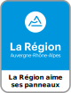

# AURA Farmer - Générateur de panneaux AURA

Générateur de panneaux `La région aide ses communes` que l'on retrouve le long des routes de notre belle région Auvergne-Rhône-Alpes.

Les panneaux avec un texte personnalisé sont exportés aux formats SVG et PNG et peuvent être téléchargés individuellement ou en lot.

    
    
    

## 🌐 Interface Web

La nouvelle interface web permet de :
- **Générer des panneaux personnalisés** avec votre propre texte
- **Ajuster la taille** des panneaux (50px à 400px)
- **Génération en lot** pour créer plusieurs panneaux d'un coup
- **Téléchargement individuel et groupé** de tous les panneaux dans un fichier ZIP
